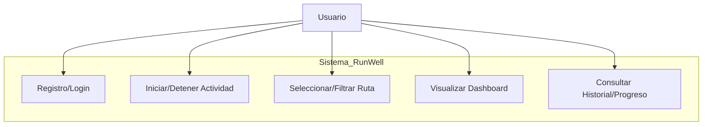

# Diagrama de Casos de Uso - RunWell

```mermaid
graph TD
    U[Usuario]
    
    subgraph Sistema_RunWell
        UC1[Registro/Login]
        UC2[Iniciar/Detener Actividad]
        UC3[Seleccionar/Filtrar Ruta]
        UC4[Visualizar Dashboard]
        UC5[Consultar Historial/Progreso]
    end
    
    U --> UC1
    U --> UC2
    U --> UC3
    U --> UC4
    U --> UC5
```
