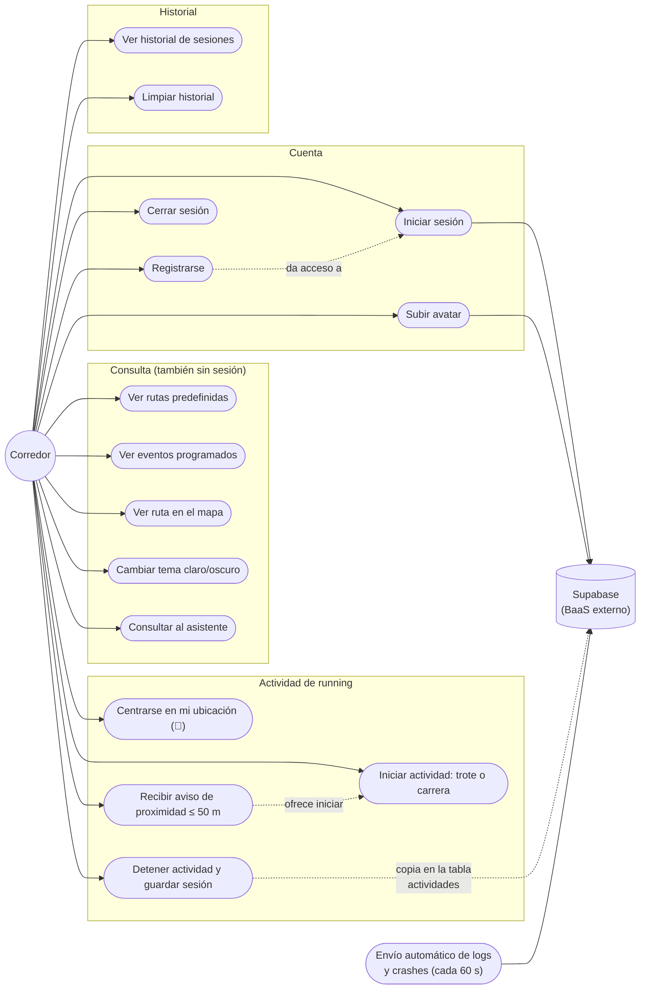

# Casos de uso — RunWell (sistema final)

Diagrama de casos de uso del sistema **tal como está implementado hoy**. Lo
pendiente (filtrado de rutas, dashboard de estadísticas) queda fuera del
diagrama y se lista aparte al final, para no dibujar funcionalidades que no
existen.

## Diagrama

## Actores

| Actor | Rol |
|---|---|
| **Corredor** | Usuario de la app: consulta rutas, corre con cronómetro, gestiona su historial y su cuenta. Puede usarla sin sesión (consulta y actividad local) o con sesión (avatar y copia en la nube). |
| **Supabase** | Sistema externo (BaaS): auth, tabla `actividades`, buckets `avatars` y `logs`. No hay servidor propio: es el único componente fuera del frontend. |

## Casos de uso y su estado

| Caso de uso | Notas de implementación |
|---|---|
| Ver rutas predefinidas | `js/datos.js` (mock data de Maracaibo) dibujado por `MapController` |
| Ver eventos programados | Sección Eventos, `EventosController` |
| Ver ruta en el mapa | Abre el mapa y centra la ruta; reabre su popup |
| Centrarse en mi ubicación (📍) | `GeolocationService`; muestra toast y popup con coordenadas y precisión |
| Recibir aviso de proximidad | ≤ 50 m a una ruta, colisión punto-segmento, cooldown de 20 s |
| Iniciar actividad (trote/carrera) | Desde el popup de la ruta o desde el aviso de proximidad; `TipoActividad` → `Trote`/`Carrera` |
| Detener actividad y guardar sesión | Guarda en `runwell-historial` y copia a la tabla `actividades` |
| Ver / limpiar historial | `HistoryRepository`, con migración de claves antiguas |
| Registrarse / iniciar sesión / cerrar sesión | `AuthService`, modal en `index.html` |
| Subir avatar | Bucket `avatars` (política de `INSERT` anónimo antes del `signUp`) |
| Cambiar tema | `Tema`, persistido en `runwell-tema` |
| Consultar al asistente | `Chatbot` (chips + respuestas sobre rutas y actividad) |
| Envío automático de logs | `Logger`: eventos, crashes y heartbeat cada 60 s al bucket `logs` |

## Pendiente (fuera del diagrama a propósito)

- Filtrado/selección de rutas por zona, distancia o dificultad.
- Dashboard de estadísticas e historial de progreso (agregados por semana/mes).

Son los casos de uso que el alcance actual no cubre; aparecer como
"planeados" en la documentación, pero **no** deben dibujarse como si
existieran.
